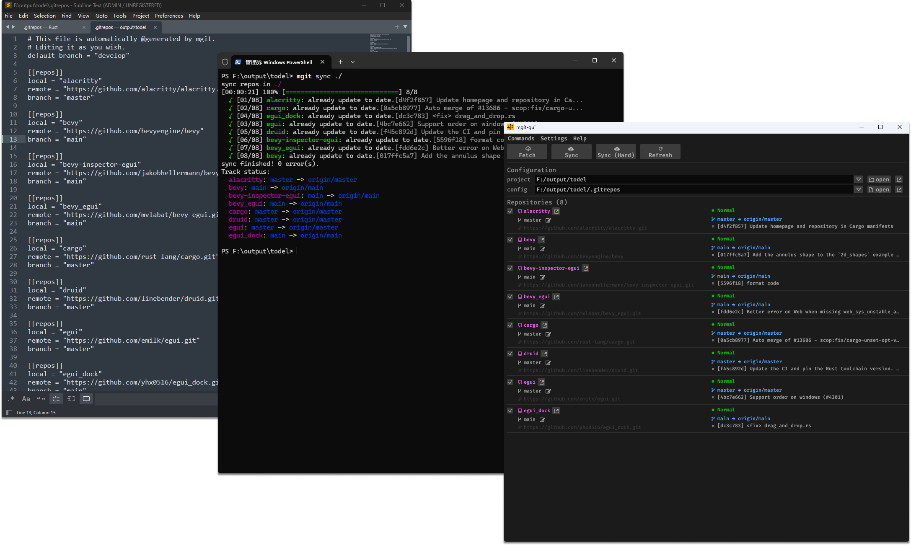

<p align="center">
  
</p>

<h1 align="center">MGIT - git 多仓库管理工具</h1>

<p align="center">
  
</p>

mgit 是一个用 rust 编写的 git 多仓库管理工具。 他的主要功能有：

- 一键生成当前文件夹下所有仓库的管理配置文件
- 根据配置文件内容，更新指定仓库的 branch，tag 或 commit
- 根据配置文件内容，清理文件夹下的无用仓库
- 提供 cli 工具和 gui 工具

## 安装

### CLI

```shell
curl -fsSL https://raw.githubusercontent.com/yhx0516/mgit/master/scripts/install-cli.sh | bash
```

脚本会自动检测平台、下载最新版 `mgit` CLI 并安装到 `~/.local/bin`（Windows → `~/.mgit/bin`）。如果 `~/.local/bin` 不在 PATH 中，脚本会提示如何添加。

手动安装：从 [GitHub Releases](https://github.com/yhx0516/mgit/releases) 下载对应平台的 `mgit-cli-<ver>-<target>.{tar.gz,zip}`，解压后将 `mgit` 放入 `$PATH`。

### 完整安装（CLI + GUI）

```shell
curl -fsSL https://raw.githubusercontent.com/yhx0516/mgit/master/scripts/install.sh | bash
```

脚本自动检测平台、下载最新版安装器并启动（macOS 挂载 DMG，Linux 打开 deb，Windows 运行 setup.exe）。安装器会同时部署 CLI（`mgit`）和 GUI（`mgit-gui`），并自动注册 PATH。按安装器提示完成即可。

手动安装：从 [GitHub Releases](https://github.com/yhx0516/mgit/releases) 下载对应平台的安装器：

| 平台 | 资产 |
|---|---|
| macOS | `mgit-<ver>-universal.dmg` |
| Linux | `mgit_<ver>_amd64.deb` |
| Windows | `mgit-<ver>-setup.exe` |

## 命令行工具 (CLI)

```shell
Usage: mgit <COMMAND>

Commands:
  init               Init git repos
  fetch              Fetch git repos
  snapshot           Snapshot git repos
  sync               Sync git repos
  clean              Clean unused git repos
  ls-files           List tree files
  track              Track remote branch
  log-repos          Log git repos
  new-remote-branch  New Remote Branch
  del-remote-branch  Delete remote branch
  new-tag            New tag
  upgrade            Upgrade mgit CLI to the latest release
  help               Print this message or the help of the given subcommand(s)

Options:
      --no-color    Disable ANSI color output
      --verbose...  Increase log verbosity
  -h, --help        Print help
  -V, --version     Print version
```

### init

```shell
mgit init [OPTIONS] [PATH]
```

初始化指定目录，扫描目录夹下的 git 仓库，并生成配置文件 `.gitrepos`

Options

- **--force** 强制执行并覆盖已有的 `.gitrepos`

### snapshot

```shell
mgit snapshot [OPTIONS] [PATH]
```

快照指定目录，扫描目录夹下的 git 仓库，并将当前 commit 记录生成配置文件

Options

- **--config `<FILE>`** 指定配置文件，默认找当前目录下的 `.gitrepos`
- **--branch** 生成 branch 快照
- **--force** 强制执行并覆盖已有的配置文件
- **--ignore** 忽略不想生成 config 文件的目录，可多次使用

### sync

```shell
mgit sync [OPTIONS] [PATH]
```

通过配置文件，拉取更新仓库。

Options

- **--config `<FILE>`** 指定配置文件，默认找当前目录下的 `.gitrepos`
- **-t, --thread `<NUMBER>`** 设置线程数量，默认是 4
- **--silent** 在 sync 中启用静默播报模式
- **--no-track** 在 sync 后不跟踪远端分支
- **--no-checkout** 在 sync 后不迁出新的远端分支
- **--stash** 在 sync 前暂存本地改动
- **--hard** 在 sync 前忽略所有本地改动
- **--ignore** 忽略不想生成 config 文件的目录，可多次使用
- **--depth** 设置 sync 的深度

Sparse checkout
通过配置文件添加 `sparse` 字段支持
```
[[repos]]
sparse = ["Doc", "/*.md"]
```


### fetch

```shell
mgit fetch [OPTIONS] [PATH]
```

对指定目录执行 `git fetch` 指令

Options

- **--config `<FILE>`** 指定配置文件，默认找当前目录下的 `.gitrepos`
- **-t, --thread `<NUMBER>`** 设置线程数量，默认是 4
- **--silent** 在 sync 中启用静默播报模式
- **--ignore** 忽略不想生成 config 文件的目录，可多次使用
- **--depth** 设置 fetch 深度

### clean

```shell
mgit clean [OPTIONS] [PATH]
```

根据配置文件的仓库路径和指定路径的仓库之间的比对结果，清理不在配置文件中的仓库。

Options

- **--config `<FILE>`** 指定配置文件，默认找当前目录下的 `.gitrepos`

### track

```shell
mgit track [OPTIONS] [PATH]
```

通过配置文件，跟踪远端分支

Options

- **--config `<FILE>`** 指定配置文件，默认找当前目录下的 `.gitrepos`
- **--ignore** 忽略不想生成 config 文件的目录，可多次使用

### ls-files

```shell
mgit ls-files [OPTIONS] [PATH]
```

通过配置文件，浏览本地文件

Options

- **--config `<FILE>`** 指定配置文件，默认找当前目录下的 `.gitrepos`

### log-repos

```shell
mgit log-repos [OPTIONS] [PATH]
```

显示指定目录下配置的仓库的 git 历史记录。

Options

- **--config `<FILE>`** 指定配置文件，默认找当前目录下的 `.gitrepos`
- **-t, --thread `<NUMBER>`** 设置线程数量，默认是 4
- **--labels `<LABELS>`** 按标签过滤显示的仓库

### new-remote-branch

```shell
mgit new-remote-branch [OPTIONS] --branch <BRANCH> [PATH]
```

在指定仓库中创建新的远端分支。

Options

- **--config `<FILE>`** 指定配置文件，默认找当前目录下的 `.gitrepos`
- **--branch `<BRANCH>`** 新分支名称（必填）
- **--new-config `<FILE>`** 新的 git repos 配置文件
- **--force** 强制创建，跳过确认提示
- **--ignore `<IGNORE>`** 忽略指定仓库，可多次使用

### del-remote-branch

```shell
mgit del-remote-branch [OPTIONS] --branch <BRANCH> [PATH]
```

删除指定仓库中的远端分支。

Options

- **--config `<FILE>`** 指定配置文件，默认找当前目录下的 `.gitrepos`
- **--branch `<BRANCH>`** 要删除的远端分支名称（必填）
- **--force** 强制删除，跳过确认提示
- **--ignore `<IGNORE>`** 忽略指定仓库，可多次使用

### new-tag

```shell
mgit new-tag [OPTIONS] --tag <TAG> [PATH]
```

在指定仓库中创建新 tag，可选择推送到远端。

Options

- **--config `<FILE>`** 指定配置文件，默认找当前目录下的 `.gitrepos`
- **--tag `<TAG>`** 新 tag 名称（必填）
- **--push** 将 tag 推送到远端
- **--ignore `<IGNORE>`** 忽略指定仓库，可多次使用

### upgrade

```shell
mgit upgrade [OPTIONS] [VERSION]
```

将 mgit CLI 升级到最新（或指定）的 release 版本。从 GitHub Releases 自动下载匹配当前平台的二进制并原地替换。

Options

- **--force** 同版本也强制重新安装
- **--pre** 包含预发布版本（beta、rc 等）
- `[VERSION]` 指定目标版本（如 `2.1.0`），不指定则取最新稳定版

## 图形界面工具 (GUI)

- 提供勾选界面，方便管理仓库
- 提供菜单选项
- 根据项目保存用户配置
- ...

## 构建

### 从源码编译

#### Linux

1. ##### 安装依赖

```bash
sudo apt update
sudo apt-get install -y \
    build-essential \
    libgtk-3-dev
```

2. ##### 使用 cargo 构建

```bash
# 构建 CLI
cargo build -p mgit-cli [--release]

# 构建 GUI
cargo build -p mgit-gui [--release]

# 构建全部
cargo build [--release]
```

#### macOS

1. ##### 安装依赖

需安装 Xcode Command Line Tools（提供 C 编译器和系统头文件）：

```bash
xcode-select --install
```

2. ##### 使用 cargo 构建

```bash
cargo build -p mgit-cli [--release]
cargo build -p mgit-gui [--release]
```

## 测试

### 使用Docker自建本地gitea服务器

#### 1. 环境准备

* 确保已经正确安装[`Docker`](https://www.docker.com/get-started/)
* 确保已经正确安装`curl`、`git`、`jq`

```bash
# 位于项目根目录下执行
tests/gitea-env/start_gitea.sh
```

> Windows 下请使用 `wsl2`

#### 2. 运行测试

```bash
cargo test --features=use_gitea
```

### 使用常规测试

#### 1. 环境准备

无需额外准备。

#### 2. 运行测试

```bash
cargo test
```

## 参考

- [git2](https://github.com/rust-lang/git2-rs)
- [clap](https://github.com/clap-rs/clap)
- [git-workspace](https://github.com/orf/git-workspace)
- [git-repo-manager](https://github.com/hakoerber/git-repo-manager)

